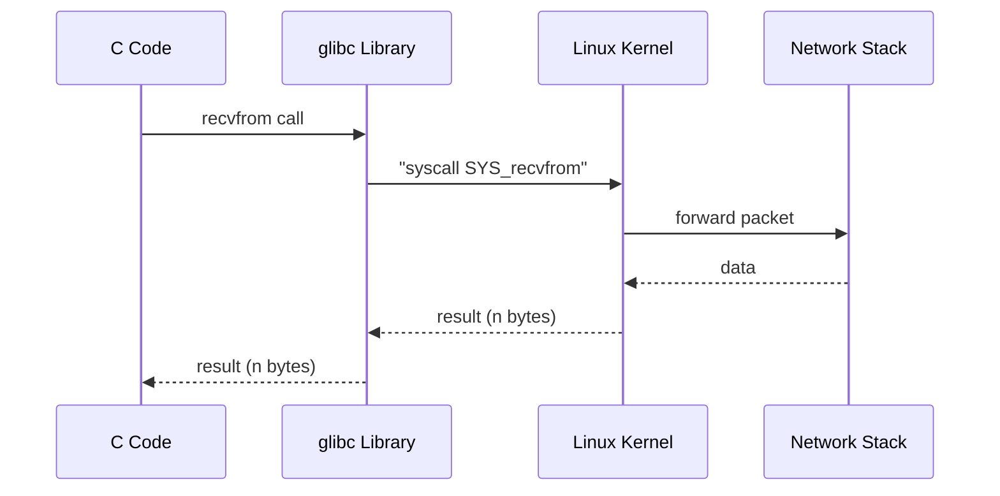
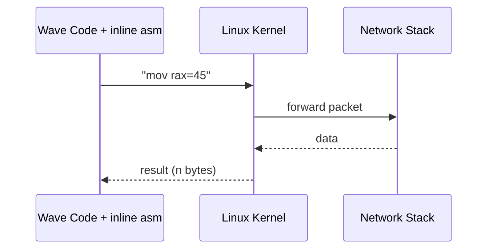

# Implementing UDP Networking in Wave: Direct recvfrom Syscall

On September 5, 2025, Wave successfully achieved its **first UDP network communication**.  
This post documents that milestone.

Although Wave is still in a pre-beta stage and currently runs only on Linux x86-64,  
this experiment proves that **Wave can directly interact with the operating system to perform network I/O**.

---

<iframe src="https://video-bmn.pages.dev/udp.mp4" width="640" height="360" frameborder="0" allowfullscreen></iframe>

---

## `recvfrom` in C

Normally, in C, receiving UDP packets looks like this:

```c
ssize_t recvfrom(int sockfd, void *buf, size_t len, int flags,
                 struct sockaddr *src_addr, socklen_t *addrlen);
```

This is a familiar libc function.  
But internally, it’s just a thin wrapper that calls the Linux kernel’s **syscall**.

Inside glibc, the implementation is essentially:

```c
return syscall(SYS_recvfrom, sockfd, buf, len, flags, src_addr, addrlen);
```

So `recvfrom()` is not magic — it’s just calling **system call number 45**.

---

## C vs Wave: Call Flow

### C Call Flow



### Wave Call Flow



👉 The only difference:

* **C** goes through glibc wrapper
    
* **Wave** talks to the kernel **directly**
    

---

## Final Wave Code

```kotlin
const AF_INET: i32 = 2;
const SOCK_DGRAM: i32 = 2;
const SYS_SOCKET: i64 = 41;
const SYS_BIND: i64 = 49;
const SYS_RECVFROM: i64 = 45;
const SYS_WRITE: i64 = 1;

fun main() {
    // 1. Create socket
    var sockfd: i64;
    asm {
        "mov rax, 41"      // SYS_SOCKET
        "syscall"
        out("rax") sockfd
        in("rdi") AF_INET
        in("rsi") SOCK_DGRAM
        in("rdx") 0
    }
    println("socket fd = {}", sockfd);

    // 2. Bind to port 8080
    var addr: array<i8, 16> = [2, 0, 0x1F, 0x90, 0,0,0,0, 0,0,0,0, 0,0,0,0];

    var ret: i64;
    asm {
        "mov rax, 49"      // SYS_BIND
        "syscall"
        out("rax") ret
        in("rdi") sockfd
        in("rsi") &addr
        in("rdx") 16
    }
    println("bind ret = {}", ret);

    // 3. Prepare buffer
    var buf: array<i8, 128>;
    var src: array<i8, 16>;
    var srclen: i32 = 16;

    // 4. Receive data
    var n: i64;
    asm {
        "mov rax, 45"      // SYS_RECVFROM
        "syscall"
        out("rax") n
        in("rdi") sockfd
        in("rsi") &buf
        in("rdx") 128
        in("r10") 0        // flags = 0 (blocking)
        in("r8")  &src
        in("r9")  &srclen
    }

    println("recvfrom got {} bytes", n);

    // 5. Write to stdout
    var ret2: i64;
    asm {
        "mov rax, 1"       // SYS_WRITE
        "syscall"
        out("rax") ret2
        in("rdi") 1
        in("rsi") &buf
        in("rdx") n
    }
}
```

---

## How It Works

1. **Socket Creation**  
    Calls `SYS_SOCKET (41)` with parameters `(AF_INET, SOCK_DGRAM)` to create a UDP socket.
    
2. **Binding**  
    Calls `SYS_BIND (49)` to bind the socket to port 8080.  
    The `addr` array represents a raw `sockaddr_in` structure.
    
3. **Receiving Data**  
    Calls `SYS_RECVFROM (45)` with correct register mapping:
    
    * rdi = sockfd
        
    * rsi = buffer pointer
        
    * rdx = buffer length
        
    * r10 = flags (0, blocking mode)
        
    * r8 = src\_addr pointer
        
    * r9 = addrlen pointer
        
4. **Writing Output**  
    Calls `SYS_WRITE (1)` to print the received data directly to stdout.
    

---

## Running the Program

1. Run Wave program:
    
    ```bash
    ./wavec run test/test61.wave
    ```
    
2. In another terminal, send a UDP packet:
    
    ```bash
    echo "hi" | nc -u 127.0.0.1 8080
    ```
    
3. Output:
    
    ```plaintext
    hi
    socket fd = 3
    bind ret = 0
    recvfrom got 3 bytes
    ```
    

---

## Significance

This experiment shows that Wave can now:

* Directly call Linux system calls
    
* Implement UDP networking without libc
    
* Receive real packets and interact with the OS network stack
    

Even though Wave is still pre-beta with no standard library,  
we have demonstrated that it can already act as a **system programming language**.

Future extensions will include:

* `sendto()` for UDP sending
    
* `connect()` / `accept()` for TCP
    
* HTTP library built in Wave
    
* Asynchronous I/O for high-performance servers